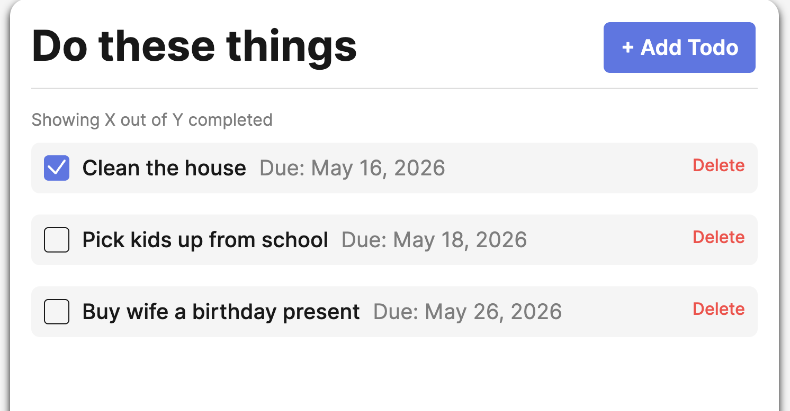
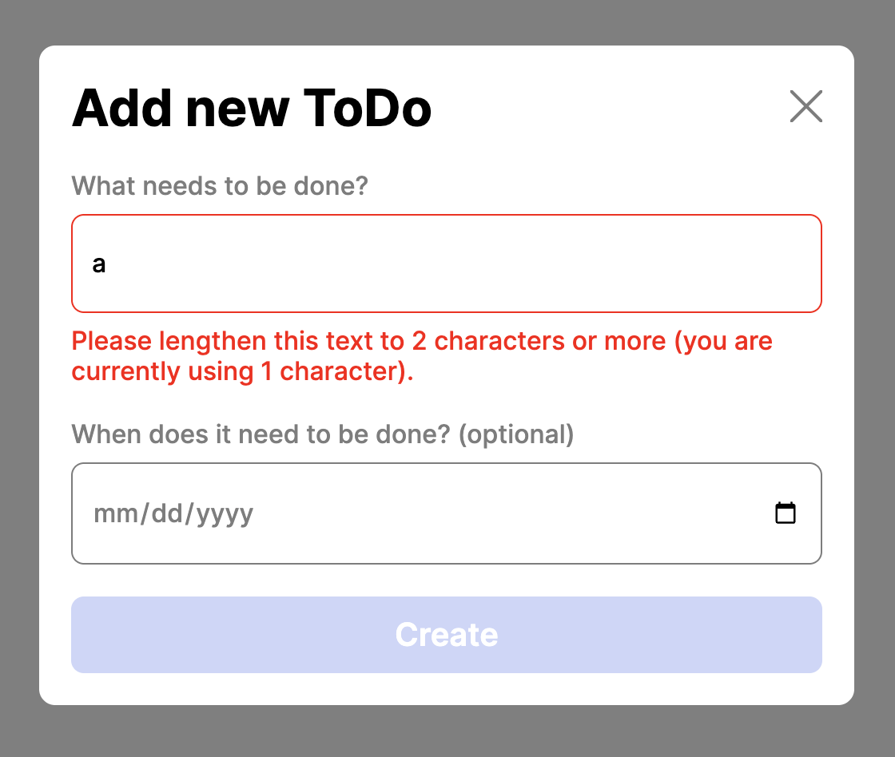

# Simple Todo App

The purpose of this app is to create individual Todo items with an optional due date. Once an item has been completed, the user can use the checkbox to mark for completion. There is also the ability to delete the Todo item from the list.

## Functionality

- Implement client-side form validation with real-time feedback
- Demonstrate the use of opening and closing modals via event listeners
- Demonstrate a thorough understanding of using OOP to organize code in JavaScript, including creating a Todo class for individual todo items
- Exercise the use of importing and exporting classes and data structures to different .js files
- Generate unique IDs for new todo items using external packages

## Technology

_Techniques_

- Object Oriented Programming (OOP)
- Modular JavaScript
- Form Validation

## Deployment

This project is deployed on GitHub Pages:

- [TodoApp Project](https://vochoa44.github.io/se_project_todo-app/)
